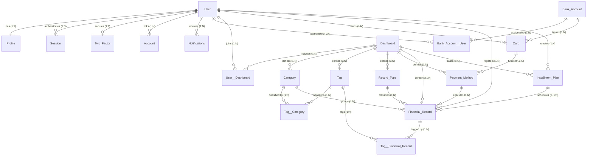

# Entity-Relationship (ER) Model

This document outlines the conceptual and logical Entity-Relationship (ER) model for **Fortis Libertas**. It defines all entity associations, relationship cardinalities (1:1, 1:N, M:N), foreign key linkages, referential integrity rules (cascading actions), and architectural descriptions across the database schema.

---

## Table of Contents

1. [Visual Entity-Relationship Diagram Simple](#visual-entity-relationship-diagram-simple)
2. [Visual Entity-Relationship Diagram Complete](#visual-entity-relationship-diagram-complete)
3. [Core Relationships Around User](#core-relationships-around-user)
4. [Core Relationships Around Dashboard](#core-relationships-around-dashboard)
5. [Financial & Banking Relationships](#financial--banking-relationships)
6. [Transaction & Financial Record Relationships](#transaction--financial-record-relationships)
7. [Classification & Tagging Relationships](#classification--tagging-relationships)
8. [Junction Tables (Many-to-Many Resolvers)](#junction-tables-many-to-many-resolvers)
9. [Full Relationship Map (Textual ERD Hierarchy)](#full-relationship-map-textual-erd-hierarchy)

---

## Visual Entity-Relationship Diagram Simple



---

## Visual Entity-Relationship Diagram Complete

```mermaid
erDiagram
    %% =========================================================
    %% Core Relationships Around User & Auth
    %% =========================================================
    User ||--|| Profile : "has (1:1)"
    User ||--o{ Session : "authenticates (1:N)"
    User ||--o| Two_Factor : "secures (1:1)"
    User ||--o{ Account : "links (1:N)"
    User ||--o{ Notifications : "receives (1:N)"
    User ||--o{ Bank_Account__User : "participates (1:N)"
    Bank_Account ||--o{ Bank_Account__User : "assigned to (1:N)"
    User ||--o{ User__Dashboard : "joins (1:N)"
    Dashboard ||--o{ User__Dashboard : "includes (1:N)"
    User ||--o{ Card : "owns (1:N)"
    Bank_Account ||--o{ Card : "issues (1:N)"
    User ||--o{ Financial_Record : "registers (1:N)"
    User ||--o{ Installment_Plan : "creates (1:N)"

    %% =========================================================
    %% Core Relationships Around Dashboard & Entities
    %% =========================================================
    Dashboard ||--o{ Category : "defines (1:N)"
    Dashboard ||--o{ Tag : "defines (1:N)"
    Dashboard ||--o{ Record_Type : "defines (1:N)"
    Dashboard ||--o{ Payment_Method : "defines (1:N)"
    Dashboard ||--o{ Financial_Record : "contains (1:N)"
    Dashboard ||--o{ Installment_Plan : "tracks (1:N)"

    %% =========================================================
    %% Transaction, Tagging & Payment Relationships
    %% =========================================================
    Card ||--o{ Payment_Method : "funds (0..1:N)"
    Category ||--o{ Tag__Category : "classified by (1:N)"
    Tag ||--o{ Tag__Category : "applies to (1:N)"
    Category ||--o{ Financial_Record : "groups (1:N)"
    Record_Type ||--o{ Financial_Record : "classifies (1:N)"
    Payment_Method ||--o{ Financial_Record : "executes (1:N)"
    Installment_Plan ||--o{ Financial_Record : "schedules (0..1:N)"
    Financial_Record ||--o{ Tag__Financial_Record : "tagged by (1:N)"
    Tag ||--o{ Tag__Financial_Record : "tags (1:N)"

    %% =========================================================
    %% Table Definitions & Columns
    %% =========================================================

    User {
        binary16 id PK
        varchar254 user_name "UK"
        varchar254 full_name
        varchar254 email "UK"
        datetime email_verified_at
        text image
        bool two_factor_enabled "default false"
        datetime deleted_at
        datetime created_at
        datetime updated_at
    }

    Profile {
        binary16 user_id PK, FK
        date birth_date
        varchar20 phone
        datetime phone_verified_at
        char3 currency "default EUR"
        varchar254 language "default pt-PT"
        datetime created_at
        datetime updated_at
    }

    Session {
        binary16 id PK
        binary16 user_id FK
        varchar255 token "UK"
        text ip_address
        text user_agent
        datetime expires_at
        datetime created_at
        datetime updated_at
    }

    Account {
        binary16 id PK
        binary16 user_id FK
        text account_id
        text provider_id
        text access_token
        text refresh_token
        text scope
        text id_token
        text password
        datetime access_token_expires_at
        datetime refresh_token_expires_at
        datetime created_at
        datetime updated_at
    }

    Two_Factor {
        binary16 id PK
        binary16 user_id FK "UK"
        text secret
        text backup_codes
        bool verified "default false"
        int failed_verification_count "default 0"
        datetime locked_until
        datetime created_at
        datetime updated_at
    }

    Verification {
        binary16 id PK
        varchar191 identifier
        text value
        datetime expires_at
        datetime created_at
        datetime updated_at
    }

    Notifications {
        binary16 id PK
        binary16 user_id FK
        varchar255 type
        json data
        datetime created_at
        datetime read_at
    }

    Bank_Account {
        binary16 id PK
        varchar50 name
        decimal10_2 initial_balance
        datetime frozen_at
        datetime deleted_at
        datetime created_at
        datetime updated_at
    }

    Bank_Account__User {
        binary16 bank_id PK, FK
        binary16 user_id PK, FK
        enum role "owner, editor, viewer"
        datetime created_at
        datetime updated_at
    }

    Card {
        binary16 id PK
        binary16 bank_id FK
        binary16 user_id FK
        varchar50 cardholder_name
        enum type_card "credit, debit"
        char16 card_number
        date expiry_date
        char3 cvv
        datetime frozen_at
        datetime deleted_at
        datetime created_at
        datetime updated_at
    }

    Dashboard {
        binary16 id PK
        varchar50 name
        bool is_active
        datetime deleted_at
        datetime created_at
        datetime updated_at
    }

    User__Dashboard {
        binary16 dashboard_id PK, FK
        binary16 user_id PK, FK
        enum role "owner, editor, viewer"
        datetime deleted_at
        datetime created_at
        datetime updated_at
    }

    Record_Type {
        binary16 id PK
        binary16 dashboard_id FK
        varchar50 name
        text description
        datetime deleted_at
        datetime created_at
        datetime updated_at
    }

    Category {
        binary16 id PK
        binary16 dashboard_id FK
        varchar50 name
        text description
        datetime deleted_at
        datetime created_at
        datetime updated_at
    }

    Tag {
        binary16 id PK
        binary16 dashboard_id FK
        varchar50 name
        text description
        datetime deleted_at
        datetime created_at
        datetime updated_at
    }

    Payment_Method {
        char26 id PK
        binary16 dashboard_id FK
        binary16 card_id FK
        varchar50 name
        text description
        datetime deleted_at
        datetime created_at
        datetime updated_at
    }

    Installment_Plan {
        binary16 id PK
        binary16 dashboard_id FK
        binary16 register_by_id FK
        decimal10_2 total_amount
        int total_installments
        datetime due_date
        enum status "default pending"
        datetime deleted_at
        datetime created_at
        datetime updated_at
    }

    Financial_Record {
        binary16 id PK
        binary16 dashboard_id FK
        binary16 register_by_id FK
        binary16 record_type_id FK
        binary16 category_id FK
        binary16 payment_method_id FK
        binary16 installment_plan_id FK
        varchar50 name
        text description
        decimal10_2 price
        varchar3 currency
        datetime payment_date
        enum status "active, settled, cancelled, pending, paid, late"
        datetime deleted_at
        datetime created_at
        datetime updated_at
    }

    Tag__Category {
        binary16 tag_id PK, FK
        binary16 category_id PK, FK
        datetime created_at
    }

    Tag__Financial_Record {
        binary16 tag_id PK, FK
        binary16 record_id PK, FK
        datetime created_at
    }
```



---

## Core Relationships Around `User`

The `User` entity serves as the root identity within the application, managing authentication, profile personalization, security credentials, and transactional ownership.

| Source Entity | Relationship Type | Target Entity | Foreign Key Column | Target Primary Key | On Delete | Description |
|:---|:---|:---|:---|:---|:---|:---|
| `User` | 1:1 (One-to-One) | `Profile` | `Profile.user_id` | `User.id` | CASCADE | Each user has exactly one personal profile containing language, currency, phone, and birth date. Deleting the user deletes the profile. |
| `User` | 1:N (One-to-Many) | `Session` | `Session.user_id` | `User.id` | CASCADE | One user can have multiple active authentication sessions across devices. |
| `User` | 1:1 (One-to-One) | `Two_Factor` | `Two_Factor.user_id` | `User.id` | CASCADE | One user has at most one 2FA configuration record (enforced by a unique constraint on `user_id`). |
| `User` | 1:N (One-to-Many) | `Account` | `Account.user_id` | `User.id` | CASCADE | One user can link multiple third-party OAuth providers (Google, GitHub, credentials). |
| `User` | 1:N (One-to-Many) | `Notifications` | `Notifications.user_id` | `User.id` | CASCADE | One user receives multiple transactional and system notifications. |
| `User` | M:N (Many-to-Many) | `Bank_Account` | `Bank_Account__User.user_id` | `User.id` | CASCADE | Users share access to bank accounts via the `Bank_Account__User` junction table with granular roles (`owner`, `editor`, `viewer`). |
| `User` | M:N (Many-to-Many) | `Dashboard` | `User__Dashboard.user_id` | `User.id` | CASCADE | Users access multiple dashboards with assigned workspace roles (`owner`, `editor`, `viewer`). |
| `User` | 1:N (One-to-Many) | `Card` | `Card.user_id` | `User.id` | RESTRICT | One user can own multiple payment cards linked to their bank accounts. |
| `User` | 1:N (One-to-Many) | `Financial_Record` | `Financial_Record.register_by_id` | `User.id` | RESTRICT | Tracks which user created each financial record for auditability. |
| `User` | 1:N (One-to-Many) | `Installment_Plan` | `Installment_Plan.register_by_id` | `User.id` | RESTRICT | Tracks which user configured each installment payment plan. |

### Relationship Descriptions

- **`User` ↔ `Profile` (1:1):** Strict 1-to-1 extension. The `user_id` column in `Profile` acts as both the primary key and foreign key with `ON DELETE CASCADE`.
- **`User` ↔ `Session` (1:N):** Tracks active login tokens, IP addresses, and user-agent strings. When a user is removed, all active sessions are invalidated.
- **`User` ↔ `Two_Factor` (1:1):** Secures the account via TOTP cryptographic secrets and backup recovery codes. An enforced unique index on `user_id` guarantees only one active 2FA configuration per user.
- **`User` ↔ `Account` (1:N):** Better Auth provider linkage enabling multiple sign-in methods (e.g. Google OAuth and credentials).
- **`User` ↔ `Notifications` (1:N):** Inbox mechanism delivering alerts, system notices, and activity updates to users.
- **`User` ↔ `Bank_Account` (M:N via `Bank_Account__User`):** Enables collaborative banking with explicit permission roles (`owner`, `editor`, `viewer`).
- **`User` ↔ `Dashboard` (M:N via `User__Dashboard`):** Supports shared family/team financial management with workspace permission roles.

---

## Core Relationships Around `Dashboard`

The `Dashboard` entity represents a multi-tenant workspace partitioning categories, tags, record types, payment methods, installment plans, and financial records.

| Source Entity | Relationship Type | Target Entity | Foreign Key Column | Target Primary Key | On Delete | Description |
|:---|:---|:---|:---|:---|:---|:---|
| `Dashboard` | M:N (Many-to-Many) | `User` | `User__Dashboard.dashboard_id` | `Dashboard.id` | CASCADE | Associates members with dashboards with roles (`owner`, `editor`, `viewer`). |
| `Dashboard` | 1:N (One-to-Many) | `Category` | `Category.dashboard_id` | `Dashboard.id` | CASCADE | One dashboard contains multiple transaction categories. Unique on `(dashboard_id, name)`. |
| `Dashboard` | 1:N (One-to-Many) | `Tag` | `Tag.dashboard_id` | `Dashboard.id` | CASCADE | One dashboard contains multiple transaction tags. Unique on `(dashboard_id, name)`. |
| `Dashboard` | 1:N (One-to-Many) | `Record_Type` | `Record_Type.dashboard_id` | `Dashboard.id` | CASCADE | One dashboard defines record types (e.g., Expenses, Income, Investment). Unique on `(dashboard_id, name)`. |
| `Dashboard` | 1:N (One-to-Many) | `Payment_Method` | `Payment_Method.dashboard_id` | `Dashboard.id` | CASCADE | One dashboard configures available payment options. Unique on `(dashboard_id, name)`. |
| `Dashboard` | 1:N (One-to-Many) | `Financial_Record` | `Financial_Record.dashboard_id` | `Dashboard.id` | CASCADE | One dashboard contains all recorded financial transactions. |
| `Dashboard` | 1:N (One-to-Many) | `Installment_Plan` | `Installment_Plan.dashboard_id` | `Dashboard.id` | CASCADE | One dashboard tracks installment financing plans. |

### Relationship Descriptions

- **`Dashboard` ↔ Workspace Entities (1:N):** Every category, tag, record type, payment method, installment plan, and financial record belongs to a specific dashboard, isolating organizational data between workspaces.
- **Composite Uniqueness:** `(dashboard_id, name)` is enforced across `Category`, `Tag`, `Record_Type`, and `Payment_Method` to ensure clean, duplicate-free nomenclature within any dashboard.

---

## Financial & Banking Relationships

Encompasses bank accounts, debit/credit cards, and payment methods configured for transaction processing.

| Source Entity | Relationship Type | Target Entity | Foreign Key Column | Target Primary Key | On Delete | Description |
|:---|:---|:---|:---|:---|:---|:---|
| `Bank_Account` | 1:N (One-to-Many) | `Card` | `Card.bank_id` | `Bank_Account.id` | RESTRICT | A bank account can have multiple physical or virtual cards (debit or credit) issued against it. |
| `Bank_Account` | M:N (Many-to-Many) | `User` | `Bank_Account__User.bank_id` | `Bank_Account.id` | CASCADE | Resolves shared access and authorization roles (`owner`, `editor`, `viewer`) for bank accounts. |
| `Card` | 0..1:N (Optional One-to-Many) | `Payment_Method` | `Payment_Method.card_id` | `Card.id` | SET NULL | Payment methods in a dashboard can optionally link to a specific card for automated reconciliation. |

### Relationship Descriptions

- **`Bank_Account` ↔ `Card` (1:N):** Bank accounts issue cards. Each card specifies its cardholder name, type (`credit`, `debit`), CVV, and expiration date.
- **`Card` ↔ `Payment_Method` (0..1:N):** Payment methods (like "Personal Visa") can link directly to a recorded card (`card_id`), while non-card payment methods (like "Cash", "Bank Transfer") leave `card_id` as `NULL`.

---

## Transaction & Financial Record Relationships

The `Financial_Record` table is the central transactional entity, linking amounts, dates, and statuses to classifications and execution methods.

| Source Entity | Relationship Type | Target Entity | Foreign Key Column | Target Primary Key | On Delete | Description |
|:---|:---|:---|:---|:---|:---|:---|
| `Dashboard` | 1:N (One-to-Many) | `Financial_Record` | `Financial_Record.dashboard_id` | `Dashboard.id` | CASCADE | Scopes transactions to a dashboard workspace. |
| `User` | 1:N (One-to-Many) | `Financial_Record` | `Financial_Record.register_by_id` | `User.id` | RESTRICT | Captures the user who submitted the record. |
| `Record_Type` | 1:N (One-to-Many) | `Financial_Record` | `Financial_Record.record_type_id` | `Record_Type.id` | RESTRICT | Classifies the transaction as Expense, Income, or Investment. |
| `Category` | 1:N (One-to-Many) | `Financial_Record` | `Financial_Record.category_id` | `Category.id` | RESTRICT | Assigns a budget category (e.g., Food, Utilities). |
| `Payment_Method` | 1:N (One-to-Many) | `Financial_Record` | `Financial_Record.payment_method_id` | `Payment_Method.id` | RESTRICT | Identifies the payment method used for the transaction. |
| `Installment_Plan` | 0..1:N (Optional One-to-Many) | `Financial_Record` | `Financial_Record.installment_plan_id` | `Installment_Plan.id` | SET NULL | Associates recurring or installment transactions with an overarching plan. |
| `Financial_Record` | M:N (Many-to-Many) | `Tag` | `Tag__Financial_Record.record_id` | `Financial_Record.id` | CASCADE | Associates multiple custom tags with transactions for search and analytics. |

### Relationship Descriptions

- **`Financial_Record` Multi-Dimensional Classification:** Each financial entry is classified along four mandatory dimensions: Workspace (`dashboard_id`), Author (`register_by_id`), Movement Type (`record_type_id`), Category (`category_id`), and Payment Instrument (`payment_method_id`).
- **`Installment_Plan` ↔ `Financial_Record` (0..1:N):** For financed purchases, multiple monthly records reference the same parent `installment_plan_id`. One-off transactions leave this foreign key `NULL`.

---

## Classification & Tagging Relationships

Provides flexible categorization, tagging, and cross-cutting labels across categories and financial records.

| Source Entity | Relationship Type | Target Entity | Foreign Key Column | Target Primary Key | On Delete | Description |
|:---|:---|:---|:---|:---|:---|:---|
| `Category` | M:N (Many-to-Many) | `Tag` | `Tag__Category.category_id` | `Category.id` | CASCADE | Categorizes budget lines with tags (e.g., linking "Groceries" with "Essential"). |
| `Tag` | M:N (Many-to-Many) | `Category` | `Tag__Category.tag_id` | `Tag.id` | CASCADE | Allows tags to span across multiple categories. |
| `Tag` | M:N (Many-to-Many) | `Financial_Record` | `Tag__Financial_Record.tag_id` | `Tag.id` | CASCADE | Labels financial transactions with multi-purpose tags. |

### Relationship Descriptions

- **`Tag` ↔ `Category` (M:N via `Tag__Category`):** Enables tagging of categories for higher-level rollup reporting (e.g. tagging both "Groceries" and "Electricity" as "Fixed Expenses").
- **`Tag` ↔ `Financial_Record` (M:N via `Tag__Financial_Record`):** Enables fine-grained transaction tagging (e.g., tagging specific holiday purchases as "Vacation 2026").

---

## Junction Tables (Many-to-Many Resolvers)

Junction tables resolve M:N relationships, enforce composite primary keys, and maintain referential integrity via cascade rules.

| Junction Table | Left Entity | Right Entity | Composite Primary Key | Cascade Behavior | Purpose & Roles |
|:---|:---|:---|:---|:---|:---|
| `User__Dashboard` | `Dashboard` (`dashboard_id`) | `User` (`user_id`) | `(dashboard_id, user_id)` | CASCADE on both FKs | Manages workspace access with roles: `'owner'`, `'editor'`, `'viewer'`. |
| `Bank_Account__User` | `Bank_Account` (`bank_id`) | `User` (`user_id`) | `(bank_id, user_id)` | CASCADE on both FKs | Manages bank account permissions with roles: `'owner'`, `'editor'`, `'viewer'`. |
| `Tag__Category` | `Tag` (`tag_id`) | `Category` (`category_id`) | `(tag_id, category_id)` | CASCADE on both FKs | Resolves many-to-many associations between tags and categories. |
| `Tag__Financial_Record` | `Tag` (`tag_id`) | `Financial_Record` (`record_id`) | `(tag_id, record_id)` | CASCADE on both FKs | Resolves many-to-many associations between tags and individual transactions. |

---

## Full Relationship Map (Textual ERD Hierarchy)

```text
User
├── Profile (1:1)
├── Session (1:N)
├── Two_Factor (1:1)
├── Account (1:N)
├── Notifications (1:N)
├── Card (1:N)
├── Financial_Record (1:N [register_by_id])
├── Installment_Plan (1:N [register_by_id])
├── Bank_Account__User (M:N) ──┬── Bank_Account
│                              └── Card (1:N) ── Payment_Method (0..1:N)
└── User__Dashboard (M:N) ─────┬── Dashboard
                               ├── Category (1:N)
                               │   ├── Tag__Category (M:N) ── Tag
                               │   └── Financial_Record (1:N)
                               ├── Tag (1:N)
                               │   ├── Tag__Category (M:N) ── Category
                               │   └── Tag__Financial_Record (M:N) ── Financial_Record
                               ├── Record_Type (1:N)
                               │   └── Financial_Record (1:N)
                               ├── Payment_Method (1:N)
                               │   └── Financial_Record (1:N)
                               ├── Financial_Record (1:N)
                               └── Installment_Plan (1:N)
                                   └── Financial_Record (1:N)

Financial_Record
├── Dashboard (M:1)
├── User (M:1 [register_by_id])
├── Category (M:1)
├── Record_Type (M:1)
├── Payment_Method (M:1)
├── Installment_Plan (M:1 [optional])
└── Tag__Financial_Record (M:N) ── Tag

Tag
├── Dashboard (M:1)
├── Tag__Category (M:N) ── Category
└── Tag__Financial_Record (M:N) ── Financial_Record

Category
├── Dashboard (M:1)
├── Tag__Category (M:N) ── Tag
└── Financial_Record (1:N)

Dashboard
├── User__Dashboard (M:N) ── User
├── Category (1:N)
├── Tag (1:N)
├── Record_Type (1:N)
├── Payment_Method (1:N)
├── Financial_Record (1:N)
└── Installment_Plan (1:N)
```
